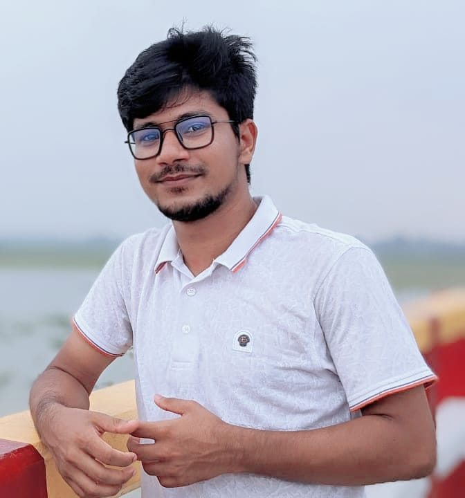

  
  

    <h1>Ismail Hossain</h1>
    
<em>Front-End Web Developer</em>

    
Studies at Department of Computer Science & Engineering in Jahangirnagar University

  

## Profile Summary
Dedicated and skilled front-end developer with a strong foundation in web technologies and a keen eye for design. Experienced in creating user-friendly interfaces and responsive websites. Passionate about learning new technologies and continuously improving coding skills.

---

## Education

- **Jahangirnagar University**  
  *Bachelor’s Degree*  
  Year of Graduation: 2022-present

- **Bogura Cantonment Public School and College**  
  GPA: 5.00  
  Graduated: 2019

- **Al Helal Islami Academy and College**  
  GPA: 5.00  
  Graduated: 2017

---

## Skills

- **Languages**: HTML, CSS, JavaScript, Java, C, C++, Database
- **Frameworks**: React, Bootstrap
- **Tools**: Git, GitHub, VS Code, Figma, Paradigm
- **Other**: Responsive Web Design

---

<!-- ## Professional Experience

- **[Current/Most Recent Company/Organization Name]**  
  *Front-End Developer*  
  [Employment Duration]  
  - Developed and maintained responsive websites and applications.
  - Collaborated with designers and back-end developers to create seamless user experiences.
  - Improved website performance and ensured cross-browser compatibility.
  - Implemented new features and optimized existing code. -->

## Projects

<!-- - **[Portfolio Website]**: Developed a personal portfolio website showcasing projects, skills, and experience. -->
- **[Web Development Projects]**:

-Tic-Tac-Toe

-Tribute page

-Guessing Game

-Current Time Show

-Dynamic CSS Color Change

- **[Robotics Project]**:

-Line Following Robot (LFR)

-Robo Soccer

-Ultrsonic Sensor

-Soil Moisture Sensor

-Obstacle Detector car

---

## Additional Experience

- **Teaching**: Provided private tuition and conducted classes at school, gaining experience in helping students understand complex concepts effectively.

---

## Certifications

- **FreeCodeCamp**: Responsive Web Design Certification
- **Buet Robotics Society**: Robotics Competition
- **Science Curnival 3.0**: Chattogram University Robot Competition
- **Technoxian Bangladesh**: 1st Technoxian Bangladesh National Round-2024

---
## Contact Me

Email: ismailraj127413@gmail.com

LinkedIn: https://www.linkedin.com/in/ismail-hossain-a613ab218/

GitHub: https://github.com/ismai402

Whatsapp: https://web.whatsapp.com/

Facebook: https://www.facebook.com/profile

Phone: 01797739109

Location: Savar,Dhaka

---

### References

**Md. Rafsan Jani**  
Associate Professor  
Department of Computer Science & Engineering  
Jahangirnagar University  
Savar, Dhaka

